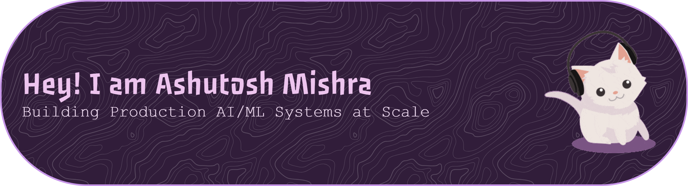
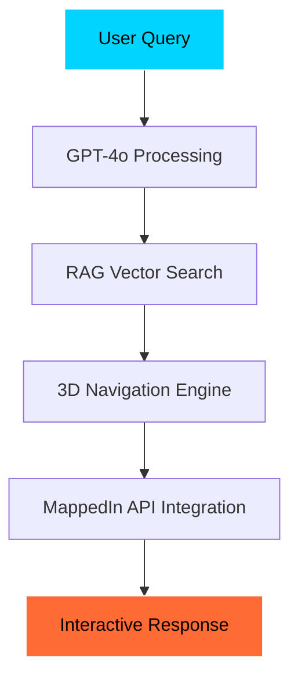
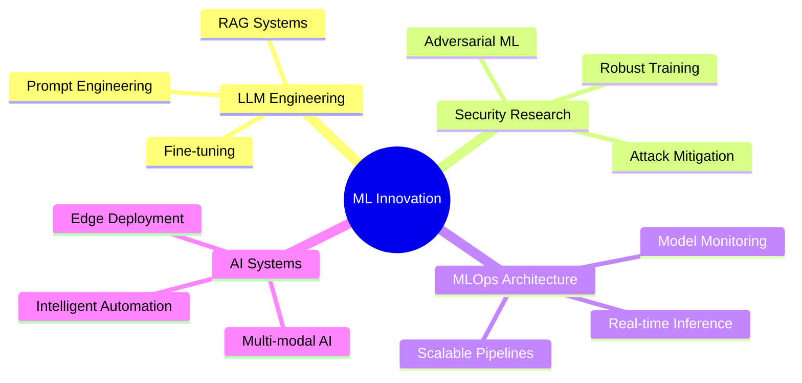

<div align="center">

<a href="https://git.io/typing-svg"></a>



<!-- Futuristic Banner -->


<!-- Social Badges with Enhanced Styling -->
<p align="center">
<a href="https://www.linkedin.com/in/ashutoshm28"></a>
<a href="https://github.com/ashutoshm97"></a>
<a href="https://donnafrontend-759125479426.us-east4.run.app/"></a>
<a href="https://doi.org/10.25394/PGS.28899152.v1"></a>
</p>

<!-- Dynamic Stats -->
<p align="center">


</p>

</div>

---

## 🧬 **About Me**

```python
class MLScientist:
    def __init__(self):
        self.name = "Ashutosh Mishra"
        self.role = "Machine Learning Scientist & AI Systems Engineer"
        self.expertise = [
            "Scalable ML Systems", "Adversarial Robustness", 
            "LLM Engineering", "MLOps Architecture"
        ]
        self.current_focus = "Next-gen AI Security & Intelligent Automation"
        self.seeking = "Full-time opportunities in ML Research + Engineering"
    
    def get_passion(self):
        return "Building robust AI systems that solve real-world problems"
```

<div align="center">

**🔬 Research-Driven • 🛠️ Engineering-Focused • 🚀 Innovation-Minded**

</div>

---

## 📊 **GitHub Analytics**

<div align="center">

<!-- Alternative Stats Layout -->


</div>

<!-- Manual Stats as Fallback -->
<div align="center">

### **📈 Development Metrics**

<table>
<tr>
<td align="center">

</td>
<td align="center">

</td>
<td align="center">

</td>
</tr>
</table>

**Primary Languages:** `Python` • `JavaScript` • `C++` • `Jupyter Notebook` • `TypeScript` • `CSS`

</div>

<!-- Activity Graph -->
<div align="center">

</div>

<!-- Streak Stats with Fallback -->
<div align="center">

</div>

---

## 🔬 **Research & Publications**

<div align="center">

### 🔐 **Enhancing Security Scalability of Arbiter PUFs Using Memory-Based Weak PUFs**

</div>

> **Breakthrough Architecture:** FF-MB-APUF design for enhanced entropy & ML attack resistance

<table align="center">
<tr>
<td align="center"><strong>🎯 Impact</strong></td>
<td align="center"><strong>⚡ Performance</strong></td>
<td align="center"><strong>🔧 Tech Stack</strong></td>
</tr>
<tr>
<td align="center">8% ↓ Attack Accuracy<br/>50M CRPs Dataset</td>
<td align="center">24h → 2h Training<br/>JAX/CuPy Optimization</td>
<td align="center">Python • JAX • CuPy<br/>NumPy • CUDA</td>
</tr>
</table>

<div align="center">

**📜 [Read Full Thesis →](https://doi.org/10.25394/PGS.28899152.v1)**

</div>

---

## 🚀 **Featured Projects**

<div align="center">

### 🎓 **[Donna – 3D Virtual Assistant](https://donnafrontend-759125479426.us-east4.run.app/)**
**🏆 DEI Award Winner | Purdue Research Symposium**

</div>



**Tech Stack:** `GPT-4o` • `Gemini` • `LangChain` • `Vector Search` • `Embeddings` • `3D WebGL`

---

<div align="center">

### 🤖 **Dynamic Transformer Architectures**
**Next-Gen Language Models with Adaptive Attention**

</div>

| Metric | Improvement | Baseline |
|--------|-------------|----------|
| BLEU Score | **+20%** | T5/BART |
| Inference Latency | **-10%** | Standard Transformers |
| Memory Efficiency | **+15%** | Parallel Processing |

**Innovation:** Adaptive attention layers with parallel encoder paths for optimized performance.

---

<div align="center">

### 🎵 **Personalized Music Recommendation System**
**Real-Time ML Pipeline with GraphQL Backend**

</div>

```python
# Architecture Highlights
recommendation_engine = {
    "collaborative_filtering": "Matrix Factorization + Deep Learning",
    "content_based": "Audio Feature Extraction + Embeddings", 
    "real_time_processing": "Flask + GraphQL + WebSocket",
    "performance_gain": "40% latency reduction"
}
```

---

## 🛠️ **Technology Arsenal**

<div align="center">

### **Languages & Frameworks**


### **MLOps & Cloud**


### **Databases & Tools**


</div>

---

<details>
<summary><b>🧰 Detailed Tech Stack</b></summary>

```yaml
Programming:
  - Python: Advanced (TensorFlow, PyTorch, Scikit-Learn)
  - C++: Systems Programming & Performance Optimization
  - JavaScript: Full-Stack Development & API Integration
  - SQL: Complex Queries & Database Design
  - MATLAB: Mathematical Modeling & Simulation

ML/AI Frameworks:
  - Deep Learning: TensorFlow, PyTorch, JAX
  - NLP: HuggingFace Transformers, LangChain, OpenAI API
  - Computer Vision: OpenCV, PIL, Detectron2
  - MLOps: MLflow, Weights & Biases, Azure ML Studio

Cloud & DevOps:
  - Platforms: Azure, GCP, AWS
  - Containers: Docker, Kubernetes
  - Orchestration: Apache Airflow, Prefect
  - Monitoring: Grafana, Prometheus, ELK Stack

Specializations:
  - Large Language Models (LLMs)
  - Retrieval-Augmented Generation (RAG)
  - Adversarial Machine Learning
  - Real-Time Analytics & Streaming
  - Security-First ML Design
```

</details>

---

## 🏆 **Achievements & Recognition**

<div align="center">

<table>
<tr>
<td align="center">

<br><sub><b>Donna AI Assistant</b></sub>
</td>
<td align="center">

<br><sub><b>Leadership Excellence</b></sub>
</td>
<td align="center">

<br><sub><b>100+ Bot Migration</b></sub>
</td>
</tr>
<tr>
<td align="center">

<br><sub><b>Security Specialist</b></sub>
</td>
<td align="center">

<br><sub><b>ML Security Research</b></sub>
</td>
<td align="center">

<br><sub><b>JAX/CuPy Implementation</b></sub>
</td>
</tr>
</table>

</div>

---

## 📈 **Current Focus Areas**

<div align="center">



</div>

---

## 📫 **Let's Build the Future Together**

<div align="center">


**🚀 Ready to tackle challenging ML problems and build impactful AI systems**

[](mailto:your.email@domain.com)
[](https://www.linkedin.com/in/ashutoshm28)
[](https://donnafrontend-759125479426.us-east4.run.app/)

</div>

---

<div align="center">

<!-- Footer Animation -->


**⚡ "Innovation distinguishes between a leader and a follower" - Steve Jobs**


</div>
