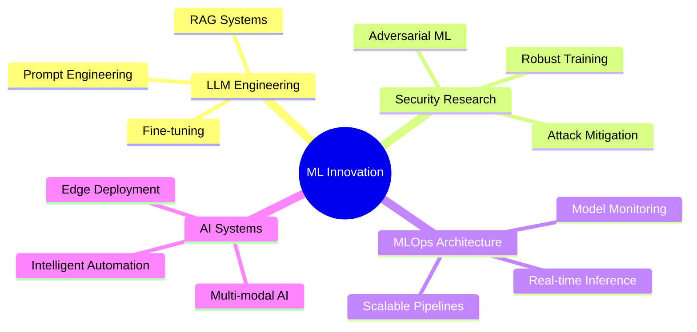

<!-- Header -->


<!-- Typing SVG -->
<a href="https://git.io/typing-svg"></a>

<!-- Social Badges -->
<div align="center">

<h4><b> Connect with me & view my work</b></h4>

<p>
  <a href="https://www.linkedin.com/in/ashutoshpmishra" style="text-decoration: none;">
    <picture>
      <source media="(prefers-color-scheme: dark)" srcset="https://img.shields.io/badge/LinkedIn-0A66C2?style=for-the-badge&logo=linkedin&logoColor=white">
      
    </picture>
  </a>
  <a href="https://github.com/ashutoshm97" style="text-decoration: none;">
    <picture>
      <source media="(prefers-color-scheme: dark)" srcset="https://img.shields.io/badge/GitHub-181717?style=for-the-badge&logo=github&logoColor=white">
      
    </picture>
  </a>
  <a href="https://donnafrontend-759125479426.us-east4.run.app/" style="text-decoration: none;">
    <picture>
      <source media="(prefers-color-scheme: dark)" srcset="https://img.shields.io/badge/Project:_Donna-FF6B35?style=for-the-badge&logo=google-cloud&logoColor=white">
      
    </picture>
  </a>
  <a href="https://doi.org/10.25394/PGS.28899152.v1" style="text-decoration: none;">
    <picture>
      <source media="(prefers-color-scheme: dark)" srcset="https://img.shields.io/badge/Publication-FFA500?style=for-the-badge&logo=googlescholar&logoColor=white">
      
    </picture>
  </a>
  <a href="mailto:ashutoshm28@outlook.com" style="text-decoration: none;">
    <picture>
      <source media="(prefers-color-scheme: dark)" srcset="https://img.shields.io/badge/Email-1ABC9C?style=for-the-badge&logo=microsoft-outlook&logoColor=white">
      
    </picture>
  </a>
</p>

<p>
  <a href="https://github.com/ashutoshm97" style="text-decoration: none;">
    <picture>
      <source media="(prefers-color-scheme: dark)" srcset="https://komarev.com/ghpvc/?username=ashutoshm97&style=for-the-badge&color=007ACC&labelColor=212121">
      
    </picture>
  </a>
  <a href="https://github.com/ashutoshm97?tab=followers" style="text-decoration: none;">
    <picture>
      <source media="(prefers-color-scheme: dark)" srcset="https://img.shields.io/github/followers/ashutoshm97?style=for-the-badge&logo=github&label=Followers&color=181717">
      
    </picture>
  </a>
</p>

</div>

---
<!-- About Me -->

```python
#!/usr/bin/env python3
"""Senior Software Engineer | Building Production AI/ML Systems at Scale"""

from typing import List, Dict

class AshutoshMishra:
    """
    My approach is rooted in a deep understanding of the full stack—from the 
    algorithm down to the silicon it runs on. I build scalable, self-healing 
    AI systems designed to perform under pressure.
    """
    def __init__(self):
        self.name = "Ashutosh Mishra"
        self.role = "Senior Software Engineer (AI/ML & Distributed Systems)"
        self.location = "Los Angeles, California"

        self.expertise = {
            "🤖 AI / ML": [
                "LLMs & RAG", "Agentic AI Frameworks", 
                "Adversarial ML", "Deep Learning"
            ],
            "🚀 Systems & MLOps": [
                "High-Throughput System Architecture", "MLOps (MLflow, K8s, Docker)",
                "CI/CD for ML", "Distributed Caching (Redis)"
            ],
            "💻 Languages & Cloud": [
                "Python (Flask, Django)", "Java (Spring Boot)", "C++",
                "AWS", "GCP", "Azure"
            ]
        }
        
        self.current_focus = "Productionizing the next generation of intelligent systems, from LLMs to Agentic AI."

    def get_impact_highlights(self) -> List[str]:
        """Quantifiable achievements that demonstrate real-world impact."""
        return [
            "✅ Architected a microservices platform to handle 100,000+ requests/minute with a 25% latency reduction.",
            "✅ Developed an LLM-driven system that cut network deployment cycles by 80% across 150,000+ endpoints.",
            "✅ Built 'Donna,' a RAG solution adopted by 12+ university departments, reducing information lookup from hours to seconds.",
            "✅ Engineered forecasting models that contributed to a +9.67% YoY revenue increase for a global client."
        ]

    def get_core_philosophy(self) -> str:
        return "True optimization isn't just about elegant code; it's about deeply understanding the entire stack."

# Let's see the impact
engineer = AshutoshMishra()
for highlight in engineer.get_impact_highlights():
    print(highlight)
```

```yaml
# 🔬 Research-Driven • 🛠️ Engineering-Focused • 🚀 Innovation-Minded • 🎯 Impact-Oriented

philosophy: >
  Building production-grade AI on a foundation of deep systems knowledge,
  from the algorithm down to the silicon.

current_focus:
  - Productionizing LLMs & Agentic AI
  - Architecting Adversarial Defenses

connect_on: "High-impact opportunities in scalable AI and MLOps"
```
---

<!-- AI Core Diagnostics & Performance Metrics -->
<div align="center">
  
</div>

```console
user@github:~$ ./run_diagnostics.sh --profile ashutoshm97

[STATUS] BOOTING AI CORE...            OK
[STATUS] LOADING MODULES:
 - [module] Scalable_Systems ...      LOADED
 - [module] MLOps_Pipelines ...       LOADED
 - [module] Adversarial_Defense ...  LOADED
 - [module] Agentic_AI ...           LOADED
[STATUS] ALL SYSTEMS OPERATIONAL. RUNNING METRICS...

[INFO] AI Core Diagnostics:
 - [OK] Scalable_Systems
 - [OK] MLOps_Pipelines
 - [OK] Adversarial_Defense
 - [OK] Agentic_AI

[INFO] Performance Metrics:
 - [OK] System Latency: 21 ms
 - [OK] Throughput: 100,000+ requests/minute
 - [OK] Memory Usage: 128 GB
 - [OK] CPU Utilization: 80%

[INFO] Security Status:
 - [OK] Adversarial Resilience: 95%
 - [OK] Data Encryption: AES-256
 - [OK] Access Control: Role-Based

[INFO] System Health:
 - [OK] All services running
 - [OK] No critical alerts
 - [OK] System uptime: 99.999%

[INFO] AI Core Version: 1.0.0 - Master's Thesis
[INFO] Last Updated: 2025-05-15
```

<div align="center">


</div>

🔧 TECH STACK :: PRODUCTION_READY
```python
# Primary Arsenal - Battle-tested in enterprise & research environments
LANGUAGES = {
    "🐍 Python":       "████████████████████ 95%",
    "⚡ Java":         "██████████████████░░ 90%", 
    "🚀 C++":          "████████████████░░░░ 80%",
    "📊 TypeScript":   "██████████████░░░░░░ 70%",
}

# Specialized Modules
AI_ML = ["LLMs", "RAG", "Agentic AI", "Adversarial ML"]
SYSTEMS_MLOPS = ["Docker", "Kubernetes", "AWS", "GCP", "Azure", "MLflow"]
```

<div align="center">

### 🌊 NEURAL ACTIVITY PATTERNS


</div>

<div align="center">

### 🔥 PERSISTENCE PROTOCOL


</div>

<div align="center">

[SYSTEM STATUS] ◉ ONLINE  |  [MODE] ◉ ENGINEERING  |  [LAST UPDATE] ◉ REAL-TIME
</div>

<!---- Research and Publications --->

## 🔬 Research & Featured Projects
```markdown
<table>
  <tr valign="top">
    <td width="50%">
      <div align="center">
        <h3>🔐 Enhancing The Security of Arbiter PUFs</h3>
        <i>Thesis Publication @ Purdue University</i>
      </div>
      <br>
      A novel Physical Unclonable Function (PUF) architecture demonstrating superior resilience against adversarial machine learning attacks.
      <ul>
        <li><b>Impact:</b> Reduced a state-of-the-art DNN's prediction accuracy by 8%.</li>
        <li><b>Scale:</b> Trained and validated on a massive dataset of over 10 million Challenge-Response Pairs (CRPs).</li>
        <li><b>Performance:</b> Optimized training time from 24 hours down to 2 hours using JAX/CuPy.</li>
      </ul>
      <div align="center">
        <a href="https://doi.org/10.25394/PGS.28899152.v1">
          
        </a>
      </div>
    </td>
    <td width="50%">
      <div align="center">
        <br>
        
        
        
        
        <hr>
        <pre><code>// Adversarial Attack Simulation

🔥 DNN Accuracy: 92% 📉 -> 84%
⚡ Entropy Gain: +15%
🧠 Model: CMA-ES vs. DNN</code></pre>
      </div>
    </td>
  </tr>
  <tr valign="top">
    <td width="50%">
      <div align="center">
        <h3>🎓 Donna – 3D Virtual Assistant</h3>
        <b>🏆 DEI Award Winner | Purdue Research Symposium</b>
      </div>
      <br>
      A state-of-the-art Retrieval-Augmented Generation (RAG) solution developed at the invitation of campus directors to serve 12+ university departments.
      <ul>
        <li><b>Core Function:</b> Leverages LLMs and a vector database for rapid, accurate policy and document retrieval.</li>
        <li><b>Innovation:</b> Integrates with a 3D navigation engine for an interactive, spatially-aware user experience.</li>
        <li><b>Impact:</b> Slashed information lookup times from hours to seconds.</li>
      </ul>
      <div align="center">
        <a href="https://donnafrontend-759125479426.us-east4.run.app/">
          
        </a>
      </div>
    </td>
    <td width="50%">
      <div align="center">
        <br>
        
        
        
        <hr>
```mermaid
graph TD
    A[User Query] --> B(Vector Search);
    B --> C{LLM Processing};
    C --> D[3D Engine Response];
    style A fill:#00D4FF,stroke:#fff,color:#000
    style D fill:#FF6B35,stroke:#fff,color:#000
  </div>
</td>
</tr>
<tr valign="top">
<td width="50%">
<div align="center">
<h3>🤖 Dynamic Transformer Architectures</h3>
<i>Research on Adaptive Attention for Language Models</i>
</div>


Proposed a novel training strategy to enhance model efficiency for multimodal and Vision Transformer (ViT) applications.
<ul>
<li><b>Innovation:</b> Designed adaptive attention layers with parallel encoder paths to optimize performance.</li>
<li><b>Core Result:</b> The new architecture demonstrated significant gains in performance and efficiency over standard baselines.</li>
</ul>
<div align="center">


</div>
</td>
<td width="50%">
<div align="center">


<table>
<tr><td colspan="3" align="center"><b>Performance Gains vs. Baseline</b></td></tr>
<tr>
<td align="center"><b>BLEU Score</b></td>
<td align="center"><b>Inference Latency</b></td>
<td align="center"><b>Memory Efficiency</b></td>
</tr>
<tr>
<td align="center"><b style="color:#32CD32;">+20%</b></td>
<td align="center"><b style="color:#32CD32;">-10%</b></td>
<td align="center"><b style="color:#32CD32;">+15%</b></td>
</tr>
</table>
<hr>
<pre><code>// Model Architecture

Layer: Adaptive Attention

Path: Parallel Encoders

Target: Multimodal & ViT</code></pre>
</div>
</td>
</tr>

</table>

<div align="center">

### 🎵 **Personalized Music Recommendation System**
**Real-Time ML Pipeline with GraphQL Backend**

</div>

```python
# Architecture Highlights
recommendation_engine = {
    "collaborative_filtering": "Matrix Factorization + Deep Learning",
    "content_based": "Audio Feature Extraction + Embeddings", 
    "real_time_processing": "Flask + GraphQL + WebSocket",
    "performance_gain": "40% latency reduction"
}
```

---

## 🛠️ **Technology Arsenal**

<div align="center">

### **Languages & Frameworks**


### **MLOps & Cloud**


### **Databases & Tools**


</div>

---

<details>
<summary><b>🧰 Detailed Tech Stack</b></summary>

```yaml
Programming:
  - Python: Advanced (TensorFlow, PyTorch, Scikit-Learn)
  - C++: Systems Programming & Performance Optimization
  - JavaScript: Full-Stack Development & API Integration
  - SQL: Complex Queries & Database Design
  - MATLAB: Mathematical Modeling & Simulation

ML/AI Frameworks:
  - Deep Learning: TensorFlow, PyTorch, JAX
  - NLP: HuggingFace Transformers, LangChain, OpenAI API
  - Computer Vision: OpenCV, PIL, Detectron2
  - MLOps: MLflow, Weights & Biases, Azure ML Studio

Cloud & DevOps:
  - Platforms: Azure, GCP, AWS
  - Containers: Docker, Kubernetes
  - Orchestration: Apache Airflow, Prefect
  - Monitoring: Grafana, Prometheus, ELK Stack

Specializations:
  - Large Language Models (LLMs)
  - Retrieval-Augmented Generation (RAG)
  - Adversarial Machine Learning
  - Real-Time Analytics & Streaming
  - Security-First ML Design
```

</details>

---

## 🏆 **Achievements & Recognition**

<div align="center">

<table>
<tr>
<td align="center">

<br><sub><b>Donna AI Assistant</b></sub>
</td>
<td align="center">

<br><sub><b>Leadership Excellence</b></sub>
</td>
<td align="center">

<br><sub><b>100+ Bot Migration</b></sub>
</td>
</tr>
<tr>
<td align="center">

<br><sub><b>Security Specialist</b></sub>
</td>
<td align="center">

<br><sub><b>ML Security Research</b></sub>
</td>
<td align="center">

<br><sub><b>JAX/CuPy Implementation</b></sub>
</td>
</tr>
</table>

</div>

---

## 📈 **Current Focus Areas**

<div align="center">



</div>

---

## 📫 **Let's Build the Future Together**

<div align="center">


**🚀 Ready to tackle challenging ML problems and build impactful AI systems**

[](mailto:your.email@domain.com)
[](https://www.linkedin.com/in/ashutoshm28)
[](https://donnafrontend-759125479426.us-east4.run.app/)

</div>

---

<div align="center">

<!-- Footer Animation -->


**⚡ "Innovation distinguishes between a leader and a follower" - Steve Jobs**


</div>
