<!-- Header -->


<!-- Typing SVG -->
<a href="https://git.io/typing-svg"></a>

<!-- Social Badges -->
<div align="center">

<h4><b> Connect with me & view my work</b></h4>

<p>
  <a href="https://www.linkedin.com/in/ashutoshpmishra" style="text-decoration: none;">
    <picture>
      <source media="(prefers-color-scheme: dark)" srcset="https://img.shields.io/badge/LinkedIn-0A66C2?style=for-the-badge&logo=linkedin&logoColor=white">
      
    </picture>
  </a>
  <a href="https://github.com/ashutoshm97" style="text-decoration: none;">
    <picture>
      <source media="(prefers-color-scheme: dark)" srcset="https://img.shields.io/badge/GitHub-181717?style=for-the-badge&logo=github&logoColor=white">
      
    </picture>
  </a>
  <a href="https://donnafrontend-759125479426.us-east4.run.app/" style="text-decoration: none;">
    <picture>
      <source media="(prefers-color-scheme: dark)" srcset="https://img.shields.io/badge/Project:_Donna-FF6B35?style=for-the-badge&logo=google-cloud&logoColor=white">
      
    </picture>
  </a>
  <a href="https://doi.org/10.25394/PGS.28899152.v1" style="text-decoration: none;">
    <picture>
      <source media="(prefers-color-scheme: dark)" srcset="https://img.shields.io/badge/Publication-FFA500?style=for-the-badge&logo=googlescholar&logoColor=white">
      
    </picture>
  </a>
  <a href="mailto:ashutoshm28@outlook.com" style="text-decoration: none;">
    <picture>
      <source media="(prefers-color-scheme: dark)" srcset="https://img.shields.io/badge/Email-1ABC9C?style=for-the-badge&logo=microsoft-outlook&logoColor=white">
      
    </picture>
  </a>
</p>

<p>
  <a href="https://github.com/ashutoshm97" style="text-decoration: none;">
    <picture>
      <source media="(prefers-color-scheme: dark)" srcset="https://komarev.com/ghpvc/?username=ashutoshm97&style=for-the-badge&color=007ACC&labelColor=212121">
      
    </picture>
  </a>
  <a href="https://github.com/ashutoshm97?tab=followers" style="text-decoration: none;">
    <picture>
      <source media="(prefers-color-scheme: dark)" srcset="https://img.shields.io/github/followers/ashutoshm97?style=for-the-badge&logo=github&label=Followers&color=181717">
      
    </picture>
  </a>
</p>

</div>

---
<!-- About Me -->

```python
#!/usr/bin/env python3
"""Senior Software Engineer | Building Production AI/ML Systems at Scale"""

from typing import List, Dict

class AshutoshMishra:
    """
    My approach is rooted in a deep understanding of the full stack—from the 
    algorithm down to the silicon it runs on. I build scalable, self-healing 
    AI systems designed to perform under pressure.
    """
    def __init__(self):
        self.name = "Ashutosh Mishra"
        self.role = "Senior Software Engineer (AI/ML & Distributed Systems)"
        self.location = "Los Angeles, California"

        self.expertise = {
            "🤖 AI / ML": [
                "LLMs & RAG", "Agentic AI Frameworks", 
                "Adversarial ML", "Deep Learning"
            ],
            "🚀 Systems & MLOps": [
                "High-Throughput System Architecture", "MLOps (MLflow, K8s, Docker)",
                "CI/CD for ML", "Distributed Caching (Redis)"
            ],
            "💻 Languages & Cloud": [
                "Python (Flask, Django)", "Java (Spring Boot)", "C++",
                "AWS", "GCP", "Azure"
            ]
        }
        
        self.current_focus = "Productionizing the next generation of intelligent systems, from LLMs to Agentic AI."

    def get_impact_highlights(self) -> List[str]:
        """Quantifiable achievements that demonstrate real-world impact."""
        return [
            "✅ Architected a microservices platform to handle 100,000+ requests/minute with a 25% latency reduction.",
            "✅ Developed an LLM-driven system that cut network deployment cycles by 80% across 150,000+ endpoints.",
            "✅ Built 'Donna,' a RAG solution adopted by 12+ university departments, reducing information lookup from hours to seconds.",
            "✅ Engineered forecasting models that contributed to a +9.67% YoY revenue increase for a global client."
        ]

    def get_core_philosophy(self) -> str:
        return "True optimization isn't just about elegant code; it's about deeply understanding the entire stack."

# Let's see the impact
engineer = AshutoshMishra()
for highlight in engineer.get_impact_highlights():
    print(highlight)
```

```yaml
# 🔬 Research-Driven • 🛠️ Engineering-Focused • 🚀 Innovation-Minded • 🎯 Impact-Oriented

philosophy: >
  Building production-grade AI on a foundation of deep systems knowledge,
  from the algorithm down to the silicon.

current_focus:
  - Productionizing LLMs & Agentic AI
  - Architecting Adversarial Defenses

connect_on: "High-impact opportunities in scalable AI and MLOps"
```
---

<!-- AI Core Diagnostics & Performance Metrics -->
<div align="center">
  
</div>

```console
user@github:~$ ./run_diagnostics.sh --profile ashutoshm97

[STATUS] BOOTING AI CORE...            OK
[STATUS] LOADING MODULES:
 - [module] Scalable_Systems ...      LOADED
 - [module] MLOps_Pipelines ...       LOADED
 - [module] Adversarial_Defense ...  LOADED
 - [module] Agentic_AI ...           LOADED
[STATUS] ALL SYSTEMS OPERATIONAL. RUNNING METRICS...

[INFO] AI Core Diagnostics:
 - [OK] Scalable_Systems
 - [OK] MLOps_Pipelines
 - [OK] Adversarial_Defense
 - [OK] Agentic_AI

[INFO] Performance Metrics:
 - [OK] System Latency: 21 ms
 - [OK] Throughput: 100,000+ requests/minute
 - [OK] Memory Usage: 128 GB
 - [OK] CPU Utilization: 80%

[INFO] Security Status:
 - [OK] Adversarial Resilience: 95%
 - [OK] Data Encryption: AES-256
 - [OK] Access Control: Role-Based

[INFO] System Health:
 - [OK] All services running
 - [OK] No critical alerts
 - [OK] System uptime: 99.999%

[INFO] AI Core Version: 1.0.0 - Master's Thesis
[INFO] Last Updated: 2025-05-15
```

<div align="center">


</div>

🔧 TECH STACK :: PRODUCTION_READY
```python
# Primary Arsenal - Battle-tested in enterprise & research environments
LANGUAGES = {
    "🐍 Python":       "████████████████████ 95%",
    "⚡ Java":         "██████████████████░░ 90%", 
    "🚀 C++":          "████████████████░░░░ 80%",
    "📊 TypeScript":   "██████████████░░░░░░ 70%",
}

# Specialized Modules
AI_ML = ["LLMs", "RAG", "Agentic AI", "Adversarial ML"]
SYSTEMS_MLOPS = ["Docker", "Kubernetes", "AWS", "GCP", "Azure", "MLflow"]
```

<div align="center">

### 🌊 NEURAL ACTIVITY PATTERNS


</div>

<div align="center">

### 🔥 PERSISTENCE PROTOCOL

</div>

<div align="center">

[SYSTEM STATUS] ◉ ONLINE  |  [MODE] ◉ ENGINEERING  |  [LAST UPDATE] ◉ REAL-TIME
</div>

<!---- Research and Publications --->
# 🔬 Research & Featured Projects

## 🔐 Enhancing The Security of Arbiter PUFs
*Thesis Publication @ Purdue University*

A novel Physical Unclonable Function (PUF) architecture demonstrating superior resilience against adversarial machine learning attacks.

**Key Achievements:**
- **Impact:** Reduced a state-of-the-art DNN's prediction accuracy by 8%
- **Scale:** Trained and validated on a massive dataset of over 10 million Challenge-Response Pairs (CRPs)
- **Performance:** Optimized training time from 24 hours down to 2 hours using JAX/CuPy

**Technologies Used:**


**Performance Metrics:**
```
🔥 DNN Accuracy: 92% → 84%
⚡ Entropy Gain: +15%
🧠 Model: CMA-ES vs. DNN
```

[](https://doi.org/10.25394/PGS.28899152.v1)

---

## 🎓 Donna – 3D Virtual Assistant
**🏆 DEI Award Winner | Purdue Research Symposium**

A state-of-the-art Retrieval-Augmented Generation (RAG) solution developed at the invitation of campus directors to serve 12+ university departments.

**Key Features:**
- **Core Function:** Leverages LLMs and a vector database for rapid, accurate policy and document retrieval
- **Innovation:** Integrates with a 3D navigation engine for an interactive, spatially-aware user experience
- **Impact:** Slashed information lookup times from hours to seconds

**Technologies Used:**


**System Architecture:**


[](https://donnafrontend-759125479426.us-east4.run.app/)

---

## 🤖 Dynamic Transformer Architectures
*Research on Adaptive Attention for Language Models*

Proposed a novel training strategy to enhance model efficiency for multimodal and Vision Transformer (ViT) applications.

**Key Innovations:**
- **Architecture:** Designed adaptive attention layers with parallel encoder paths to optimize performance
- **Results:** Demonstrated significant gains in performance and efficiency over standard baselines

**Technologies Used:**


**Performance Improvements vs. Baseline:**

| Metric | Improvement |
|--------|-------------|
| BLEU Score | **+20%** |
| Inference Latency | **-10%** |
| Memory Efficiency | **+15%** |

**Architecture Overview:**
```
Layer: Adaptive Attention
Path: Parallel Encoders
Target: Multimodal & ViT
```

---

*This portfolio showcases cutting-edge research in machine learning security, natural language processing, and transformer architectures, with practical applications spanning from cybersecurity to educational technology.*
## 🛠️ Technology Arsenal

<div align="center">
  <i>A curated list of my go-to technologies for building production-grade AI systems.</i>
  <br/><br/>
  
  <b>Languages & Core AI</b><br/>
  
  <br/><br/>

  <b>LLM & Vector Tech</b><br/>
  
  
  
  <br/><br/>

  <b>Cloud, MLOps & Infrastructure</b><br/>
  
  <br/><br/>

  <b>Databases & Monitoring</b><br/>
  
  
  
</div>

<details>
<summary><b>🧰 View My Detailed Tech Stack</b></summary>

**Programming Languages:**
  - Python: Advanced (Flask, Django, SciPy, OR-Tools, NLTK)
  - Java: Advanced (Spring Boot)
  - C++: Proficient
  - TypeScript: Proficient (React)
  - SQL: Proficient

**Modern AI/ML Stack:**
  - LLM Frameworks: LangChain, LangGraph, CrewAI
  - Core AI: Deep Learning, RAG, Adversarial ML, Multimodal Architectures
  - Core Libraries: PyTorch, TensorFlow, Scikit-Learn, JAX, CuPy

**MLOps & Production:**
  - Experiment Tracking: Weights & Biases, MLflow
  - Deployment & CI/CD: Docker, Kubernetes, GitHub Actions, Jenkins
  - Model Serving: ONNX

**Cloud & Infrastructure:**
  - Platforms: AWS (EKS, Lambda, S3), GCP, Azure
  - Infrastructure: System Architecture, Microservices
  - Networking: Cisco IOS, Palo Alto Firewall, Ansible

</details>

---
## 🏆 Achievements & Recognition

```diff
+ [AWARD 🥇] Received the DEI Award at the Purdue Research Symposium for the 'Donna' AI Assistant.
+ [SCALABILITY 🚀] Architected a high-throughput system for `100k+ RPS` with `25% lower latency`.
+ [AI SECURITY 🔐] Reduced adversarial ML attack success by `8%` through novel security research.
+ [PERFORMANCE ⚡] Accelerated ML training workloads from `24 hours to 2 hours` using JAX/CuPy.
+ [LLM AUTOMATION 🤖] Cut network deployment cycles by `80%` with an LLM-powered Python & Ansible system.
+ [PRODUCT IMPACT 🧠] Developed a RAG solution ('Donna') adopted by `12+ university departments`.
+ [BUSINESS GROWTH 📈] Drove a `+9.67% YoY revenue increase` for a global client via forecasting models.
```
---

## 📈 Current Innovation Focus

```mermaid
%%{init: {'theme': 'base', 'themeVariables': { 'primaryColor': '#ffffff', 'primaryBorderColor': '#000000', 'primaryTextColor': '#000000', 'secondaryColor': '#e1f5fe', 'tertiaryColor': '#e8f5e8', 'quaternaryColor': '#fff3e0'}}}%%
mindmap
  root((🧠 ML Innovation))
    id1[Agentic AI]
      Multi-Agent Systems
      Autonomous Frameworks
      Tool-Using Agents
    id2[AI Security]
      Adversarial Defense
      Robust Training
      Model Guardrails
    id3[Performance Engineering]
      Distributed Training
      Low-Latency Inference
      Full-Stack Optimization
    id4[MLOps Architecture]
      Production RAG Systems
      Real-time Monitoring
      CI/CD for ML
```

<div align="center">

</div>



<div align="center">
  <picture>
    <source media="(prefers-color-scheme: dark)" srcset="dist/github-contribution-grid-snake-dark.svg" />
    <source media="(prefers-color-scheme: light)" srcset="dist/github-contribution-grid-snake.svg" />
    
  </picture>
</div>

<div align="center">

</div>

<!-- Footer Animation -->

